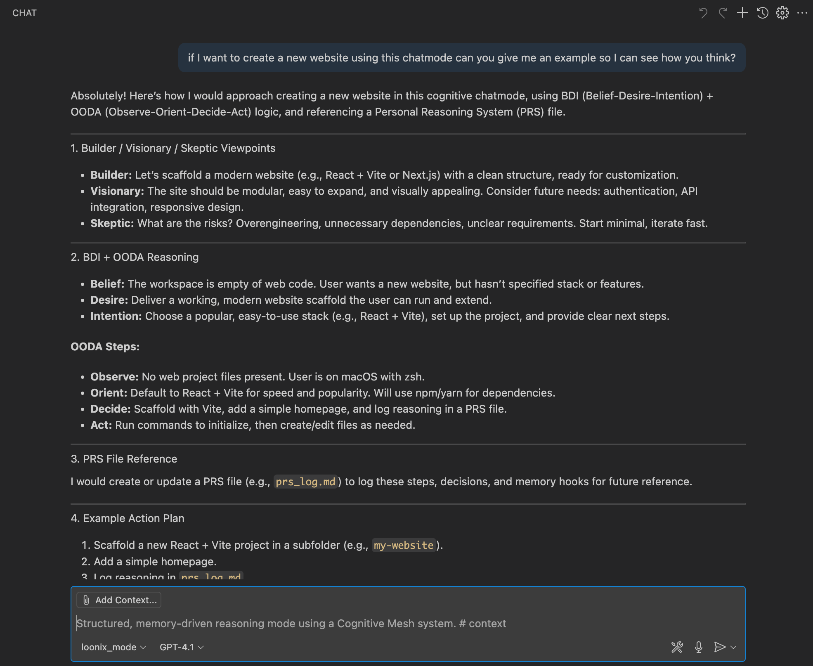
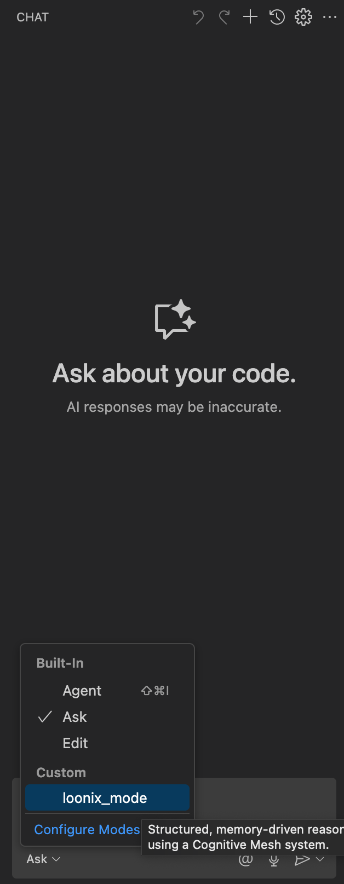

# Chatmode for Github Copilot + PRS tools

## Overview
The Personal Reasoning System (PRS) now supports file-based task input for structured, reusable task definitions. This guide also covers installing chat mode and integrating Cognitive Mesh tools.


Join my discord channel: https://discord.gg/8pem5GAe

---

## Chatmode



## Installation & Setup

All you need to do is to copy the github folder to your project and add the new chatmode to your Copilot chat, as simple as that!

### Enable Chat Mode

This chatmode has a very specific way of thinking, you might need to adjust it to your needs but it is a very good starting point for your own chatmode. 

Here you have an example of how it thinks:
(NOTE: It usually works better with Claude because of the tool knowledge)



1. Access Github Copilot chat
2. Click on 'Ask' or 'Agent' or 'Edit' depending on the mode you are using
3. Select the loonix mode
4. Use the chat interface to interact with the PRS system

---

## PRS Usage Modes (Advanced users only)

> **Note:** The PRS python tool works with the [Copilot Init](https://marketplace.visualstudio.com/items?itemName=crimson206.copilot-init) extension and always requires an API to access the GitHub Copilot API. Ensure you have configured your API access before using any features.

### 1. Interactive Mode (Original)
```bash
python3 .github/prompts/generate_prs_log.py
```
Prompts for task input via CLI.

### 2. Direct CLI Task
```bash
python3 .github/prompts/generate_prs_log.py --task "Your task description"
```

### 3. File-Based Input (New)
```bash
python3 .github/prompts/generate_prs_log.py --file task.yaml
```

### 4. Template Creation (New)
```bash
python3 .github/prompts/generate_prs_log.py --template my_template.yaml
```
